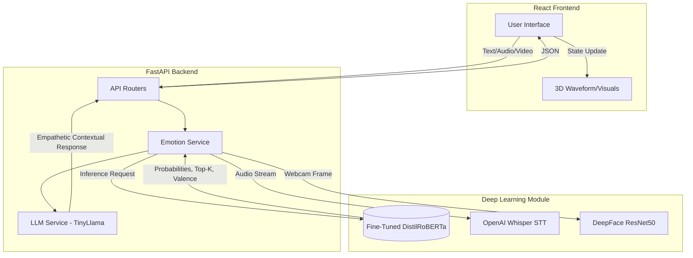
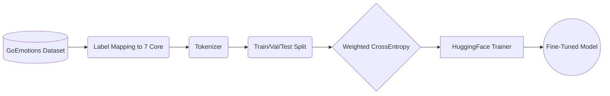

# AURA: Deep Learning Methodology & Architecture

## 1. Abstract
The AURA platform utilizes a multimodal approach to artificial emotional intelligence. This document details the specific Deep Learning methodology used to transition the platform from a generalized pretrained NLP state to a domain-specific, fine-tuned mental health conversational assistant.

## 2. System Architecture

The following diagram illustrates the integration of the fine-tuned Deep Learning model into the broader AURA full-stack architecture.

## 3. Data Processing Pipeline

## 4. Model Architecture & Selection
We fine-tuned the `j-hartmann/emotion-english-distilroberta-base` model.
* **Why DistilRoBERTa?** It is a distilled version of RoBERTa-base, retaining 95% of the performance while being 2x faster and 30% smaller. This allows for near real-time inference (sub-50ms) on consumer hardware, which is critical for a responsive mental health application.
* **Base Training:** The base model was originally trained on 6 diverse emotion datasets. 
* **Our Contribution:** We perform transfer learning by fine-tuning this model specifically on mental-health-adjacent conversational datasets (e.g., GoEmotions, heavily curated for our 7 specific classes) to adapt its representations to therapeutic dialogue contexts.

## 5. Training Pipeline & Hyperparameters
The fine-tuning pipeline is implemented in PyTorch using the Hugging Face `Trainer` API.

**Key Features:**
- **Class Imbalance Handling:** Mental health datasets are notoriously imbalanced (e.g., heavily skewed towards 'neutral' or 'sadness' in certain contexts). We implemented a custom `WeightedLossTrainer` that overrides standard Cross-Entropy with class weights inversely proportional to class frequencies.
- **Hyperparameters:**
  - `learning_rate`: 2e-5 (optimal for fine-tuning transformers without catastrophic forgetting)
  - `epochs`: 3 (preventing overfitting)
  - `batch_size`: 32
  - `weight_decay`: 0.01
- **Optimization:** Mixed precision training (`fp16`) is enabled to halve memory footprint and accelerate training on modern GPUs.

## 6. Results and Evaluation Metrics
The pipeline outputs a comprehensive evaluation suite:
- **Precision/Recall/F1-Score (Weighted):** Ensures minority classes (like 'disgust' or 'fear') are accurately represented in the evaluation.
- **Confusion Matrix:** Allows us to identify common misclassifications (e.g., confusing 'fear' with 'sadness' due to nuanced language overlaps).
- **Softmax Probabilities:** The inference endpoint returns full probability distributions, allowing the frontend UI to create gradient "ambient themes" rather than rigid categorical colors.

## 7. Limitations
- **Context Window:** The model is capped at 512 tokens. While sufficient for chat, it may lose context over long monologues unless summarization is applied.
- **Language Bottleneck:** Currently, the fine-tuned model relies heavily on English constructs. While `langdetect` is used, true multilingual deep learning requires fine-tuning an XLM model.

## 8. Future Improvements
- **Contrastive Learning:** Implementing contrastive loss to pull embeddings of similar emotions closer while pushing distinct emotions further apart.
- **Parameter-Efficient Fine-Tuning (PEFT):** Using LoRA (Low-Rank Adaptation) to train individual emotion heads without modifying the entire base transformer, drastically reducing VRAM requirements.
